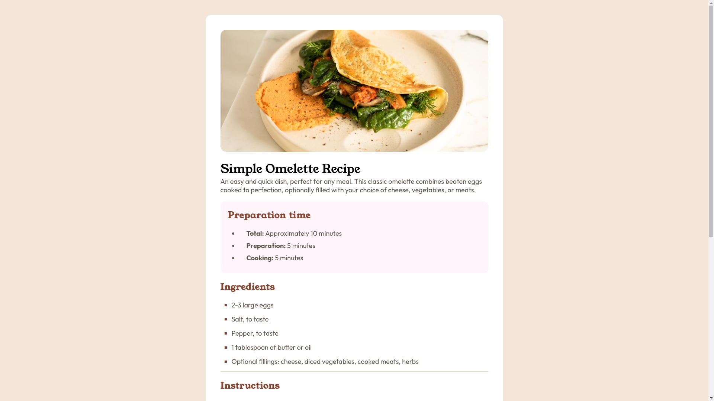

# Frontend Mentor - Recipe

This is a solution to the [Recipe on Frontend Mentor](https://www.frontendmentor.io/challenges/pricing-component-with-toggle-8vPwRMIC). Frontend Mentor challenges help you improve your coding skills by building realistic projects.

## Table of contents

- [Overview](#overview)
  - [The challenge](#the-challenge)
  - [Screenshot](#screenshot)
  - [Link](#link)
- [My process](#my-process)
  - [Built with](#built-with)
- [Author](#author)

### Screenshot

### Link

- Site URL: [Live Demo](https://solution-recipe-page-main.netlify.app/)

## My process

### Built with

- Semantic HTML5 markup
- CSS custom properties
- Flexbox

## Author

- Website - [Hikmat](https://www.hikmatbek.uz)
- Frontend Mentor - [@HikmatKhiva](https://www.frontendmentor.io/profile/HikmatKhiva)
